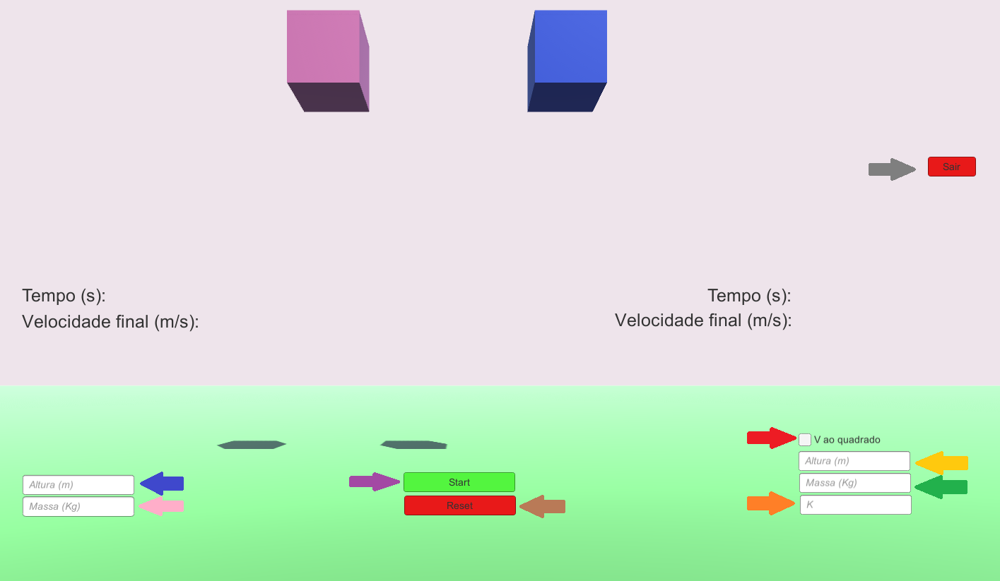
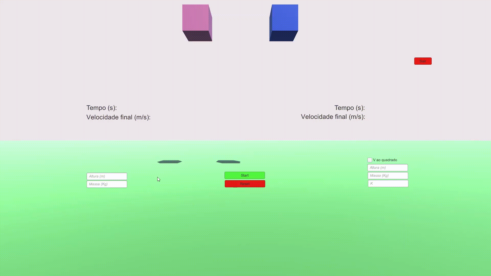

<h1 align="center" font-size="200em"><b>Simulador de Queda Livre</b></h1>

## 📌Sumário
- [Introdução](#Introdução)
- [Objetivos](#Objetivos)
- [Desenvolvimento](#Desenvolvimento)
- [Resultados](#Resultados)
- [Compilação e execução](#Compilação-e-execução)
- [Contato](#Contato)

## ✒️Introdução

No campo da mecânica, há o estudo de "Queda livre", um conceito fundamental, muito utilizado para analisar o movimento dos corpos em condições ideais, ou seja, desconsiderando a resistência do ar. No entanto, em situações reais, a presença do ar pode influenciar significativamente o tempo de queda livre de um objeto. A queda livre ocorre quando um corpo de massa m é abandonado no ambiente e descreve uma trajetória em direção ao solo, sob ação da aceleração da gravidade.  
Neste projeto, será apresentado um simulador de queda livre. Os simuladores são ferramentas essenciais para o estudo e compreensão de diversos fenômenos físicos. Ele foi desenvolvido através do programa Unity e utiliando a linguagem de programação C#. 
O simulador é capaz de calcular o tempo de queda livre de dois objetos: um não terá a influência da resistência do ar, e o outro poderá ou não, estar sujeito à essa influência. Além disso, permite que o usuário escolha a massa e a altura de cada objeto, possibilitando uma análise comparativa dos tempos de queda, pelos valores que o estudante deseja analisar.
 

## 💻Objetivos
O simulador permite demonstrar de forma visual o funcionamento desse princípio tanto em objetos sujeitos à resistência do ar quanto em objetos livres dessa influência. Essa ferramenta proporciona aos alunos uma compreensão mais prática e visual do tema, facilitando o processo de aprendizado. 

## 🔨Desenvolvimento
* Especificações da máquina em que o código foi desenvolvido e executado:
    * Processador Intel Core i5, 7th Gen;
    * Sistema Operacional Windows 10;
    * Terminal do WSL: Ubuntu 20.04.5;
    * 8GB de RAM.

## 👾Download e execução 
* Instruções de download
    * Ao abrir o repositório do GitHub, clique no botão verde "Code" e baixe o .zip do projeto;
    * Descompacte a pasta na pasta desejada no seu computador;
    * Abra o arquivo "New Unity Project.exe", que a simulação será executada.

* Instruções para o funcionamento do programa:

    * Existem dois blocos, um do lado esquerdo (Bloco 1) e um outro na direita (Bloco 2). Cada um possui caixas de texto para inserção de seus respectivos dados.
    * Para o da esquerda, é necessário informar a massa e a altura em que deseja calcular a queda.

    * Para o da direita, é necessário informar além da massa e da altura, a constante K(constante de arasto), caso não deseje que essa força atue sobre o bloco, você pode definir a constante K como 0. Se deseja que a fórmula para o cálculo da força de arrasto seja V² (K . V²), é importante selecionar essa condição. 
    * Após colocado os valores de cada objeto, deve ser pressionado o botão de start para iniciar a simulação e os cálculos do tempo gasto até o objeto atingir o solo e sua velocidade final antes da colisão.
    * Se desejado realizar novos cálculos, necessário apenas apertar o botão de 'reset' e colocar os novos valores.
    

* Onde deverá ser digitado os valores:
    * Bloco 1:
        * Seta azul: a altura (m)
        * Seta rosa: a massa (Kg)

    * Bloco 2
        * Seta amarela: a altura (m)
        * Seta verde: a massa (Kg)
        * Seta laranja: a constante de arrasto K. 
        * Seta vermelha: aqui deverá ser ser selecionado, caso queira utilizar, a velocidade ao quadrado para os cálculos.

    * Botões de controle:
        * Seta roxa: Iniciar o simulador
        * Seta marrom: Resetar os valores
        * Seta cinza: Sair do programa

## 🎯Resultados

## 📞Contato

  
 Anna Laura Moura Santana

 <a href=" ">
  
 

<a style="color:black" href="mailto:nalauramoura@gmail.com?subject=[GitHub]%20Source%20Dynamic%20Lists">
✉️ <i>nalauramoura@gmail.com</i>
</a>

 
 Julia Rezende

 <a href="https://t.me/juliarezende34">
  
 

<a style="color:black" href="mailto:juliarezende34@gmail.com?subject=[GitHub]%20Source%20Dynamic%20Lists">
✉️ <i>juliarezende34@gmail.com</i>
</a>
 

  
 Jullia Fernandes

 <a href="https://t.me/JulliaFernandes">
  
 

<a style="color:black" href="mailto:julliacefet@gmail.com?subject=[GitHub]%20Source%20Dynamic%20Lists">
✉️ <i>julliacefet@gmail.com</i>
</a>

  
 Mariana Rodrigues Lamounier Melo

 <a href=" ">
  
 

<a style="color:black" href="mailto:mariana.itapec@gmail.com?subject=[GitHub]%20Source%20Dynamic%20Lists">
✉️ <i>mariana.itapec@gmail.com</i>
</a>